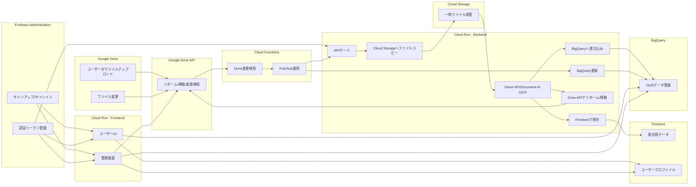
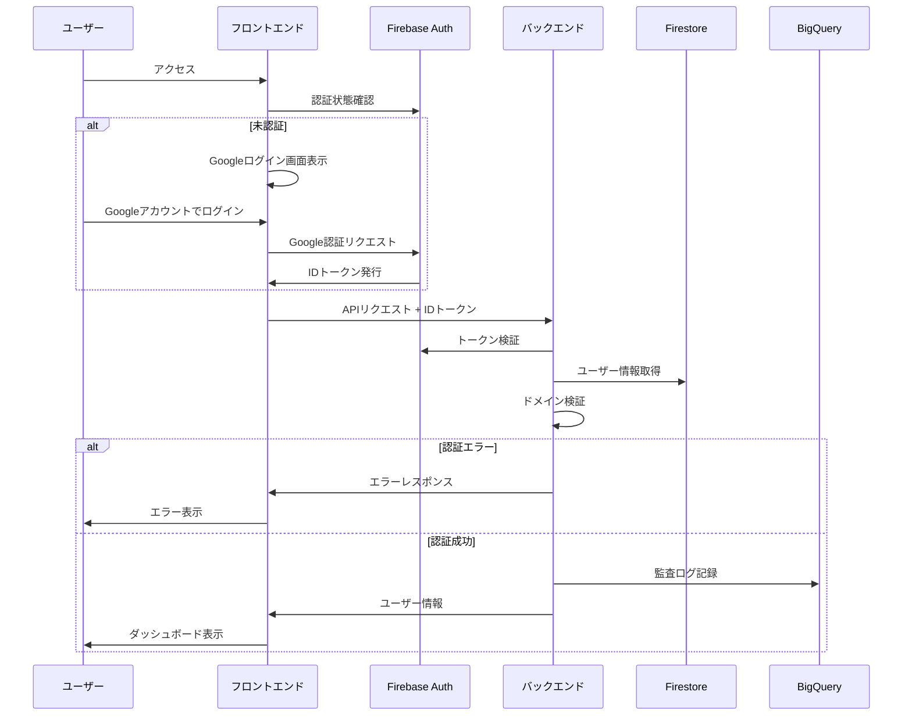
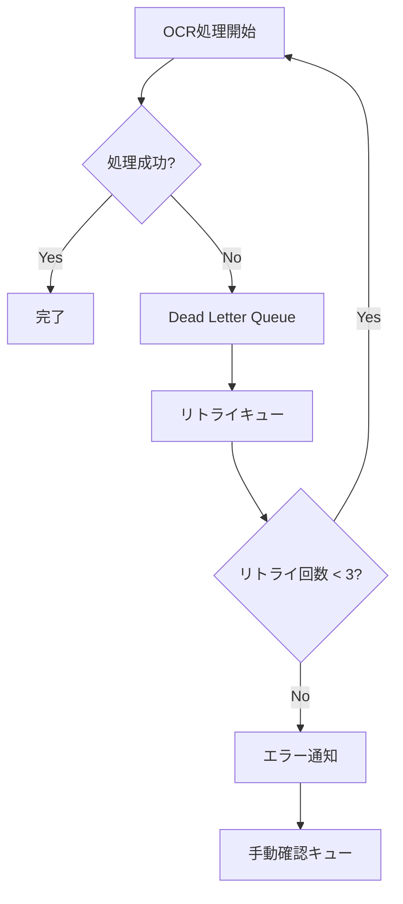

# Google Cloudを活用したファイル管理システム 設計ドキュメント

## 全体概要
本ドキュメントは、Google Cloud上でPDFや画像ファイルのOCR処理を自動化し、ファイル名のリネームやフォルダ移動、メタ情報管理を効率化するシステムの設計・実装手順を示します。Google Driveを入口とし、Vision API / Document AIを用いてファイルのテキストを抽出し、FirestoreとBigQueryでメタデータを管理・検索します。認証にはFirebase AuthenticationによるGoogleアカウントのシングルサインオン（SSO）を採用し、管理者が許可したアカウントやドメインのみがアクセス可能な設計となっています。

---

## 1. システム全体の概要

- **Google Drive** : PDF/画像ファイルの保存先。
- **Cloud Functions** : Google Drive APIの変更通知 (Webhook) からイベントを受け取り、バックエンド処理をトリガー。
- **Cloud Run (Backend)** : REST APIサーバとして稼働し、以下の業務ロジックを提供:
     - Drive APIへのリクエスト (リネーム・移動)
     - Cloud Storageへの一時ファイル保存
     - Vision API/Document AIでOCR
     - OCR結果をFirestoreとBigQueryに書き込み
- **Cloud Storage** : OCR処理時にファイルを一時保存する領域。
- **Vision API / Document AI** : 画像やPDFをOCRし、抽出テキストを返す。
- **Firestore** : 照合用DB (高頻度アクセス向け)。
- **BigQuery** : 大量のファイルメタ情報を蓄積し、分析・レポート用途に活用。
- **Cloud Run (Frontend)** : ユーザーUIと管理画面をホストし、ブラウザアクセスに対応。

---

## 2. システム構成図



---

## 3. 機能ごとの詳細

### 3.1 バックエンドコンポーネント

1. **Cloud Functions**
   - Google Drive APIのWebhookを受け、ファイルアップロードや更新イベントを検知。
   - 必要に応じてPub/Subを介してCloud Run Backendへ通知し、大量処理時のスケーラビリティを確保。

2. **Cloud Run (Backend)**
   - REST APIサーバとして稼働し、以下の業務ロジックを提供:
     - Drive APIへのリクエスト (リネーム・移動)
     - Cloud Storageへの一時ファイル保存
     - Vision API/Document AIでOCR
     - OCR結果をFirestoreとBigQueryに書き込み

3. **Firestore**
   - 照合用DB (高頻度アクセス向け)。
   - ユーザー検索やフロントエンド表示に最適化。

4. **BigQuery**
   - 大量のファイルメタ情報を蓄積し、分析・レポート用途に活用。
   - Drive上のファイルを横断的に検索したり、各種統計を可視化できる。

5. **Cloud Storage**
   - OCR処理の際、一時的にファイルを格納する領域。
   - Vision APIやDocument AIが参照しやすい形式で配置。

6. **Vision API / Document AI**
   - 画像やPDFからテキストを抽出し、結果をJSON形式で返す。
   - シンプルな画像にはVision API、高度なドキュメント解析にはDocument AIを使い分け。

### 3.2 フロントエンドコンポーネント

1. **Cloud Run (Frontend)**
   - ユーザーUI: Google Drive内のファイル一覧や検索結果を表示。OCR結果の閲覧・ダウンロード・編集など。
   - 管理画面: 権限管理 (Firestore上のユーザーリスト)、メタ情報の確認 (BigQueryからの集計データ)、OCR設定の変更などを行う。
   - Firebase Authenticationなどを組み合わせることでユーザー・管理者を判定。

2. **Drive API**
   - フロントエンドからDrive上のファイル情報を取得し、プレビューやメタデータを表示可能にする。

3. **Firestore API / BigQuery API**
   - フロントエンドがFirestoreやBigQueryのデータを検索し、一覧表示や集計レポートを生成。

---

## 3.3 認証・認可システム

### 3.3.1 認証フロー

1. **ログインフロー**
   ```mermaid
   sequenceDiagram
       participant User as ユーザー
       participant Frontend as フロントエンド
       participant Firebase as Firebase Auth
       participant Backend as バックエンド
       participant Firestore as Firestore
       participant BigQuery as BigQuery
       
       User->>Frontend: アクセス
       Frontend->>Firebase: 認証状態確認
       
       alt 未認証
           Frontend->>Frontend: Googleログイン画面表示
           User->>Frontend: Googleアカウントでログイン
           Frontend->>Firebase: Google認証リクエスト
           Firebase->>Frontend: IDトークン発行
       end
       
       Frontend->>Backend: APIリクエスト + IDトークン
       Backend->>Firebase: トークン検証
       Backend->>Firestore: ユーザー情報取得
       Backend->>Backend: ドメイン検証
       
       alt 認証エラー
           Backend->>Frontend: エラーレスポンス
           Frontend->>User: エラー表示
       else 認証成功
           Backend->>BigQuery: 監査ログ記録
           Backend->>Frontend: ユーザー情報
           Frontend->>User: ダッシュボード表示
       end
   ```

2. **APIエンドポイント一覧**

   a. ユーザー管理
   ```
   POST   /users              - 新規ユーザー作成（管理者のみ）
   GET    /users/{user_id}    - ユーザー情報取得
   PUT    /users/{user_id}    - ユーザー情報更新
   DELETE /users/{user_id}    - ユーザー削除（管理者のみ）
   ```

   b. 認証設定
   ```
   GET    /auth/settings      - 認証設定取得
   PUT    /auth/settings      - 認証設定更新（管理者のみ）
   ```

   c. ドメイン管理
   ```
   POST   /auth/domains       - 許可ドメイン追加（管理者のみ）
   GET    /auth/domains       - 許可ドメイン一覧取得
   PUT    /auth/domains/{id}  - 許可ドメイン更新（管理者のみ）
   GET    /auth/validate-domain/{domain} - ドメイン検証
   ```

3. **エラーハンドリング**
   - 400: リクエスト不正
   - 401: 認証エラー
   - 403: 権限エラー
   - 404: リソース未発見
   - 500: サーバーエラー

4. **監査ログ**
   記録対象のアクション：
   - ユーザーログイン/ログアウト
   - ユーザー作成/更新/削除
   - 認証設定の変更
   - ドメイン設定の変更
   - アクセス拒否（ドメイン制限など）

### 3.3.2 ユーザー管理

1. **ユーザー情報**
   - ユーザーID
   - メールアドレス
   - ユーザー名
   - ロール（一般ユーザー、管理者）
   - 所属情報

2. **ユーザー権限**
   - 一般ユーザー
     - ファイルの閲覧・アップロード
     - 自身のプロファイル管理
   - 管理者
     - ユーザー管理
     - 認証設定の管理
     - システム設定の管理

3. **ユーザー管理画面**
   - ユーザー一覧
   - ユーザー追加
   - ユーザー編集
   - ユーザー削除

### 3.3.3 認証設定

1. **認証方式**
   - Googleアカウント認証（シングルサインオン）

2. **認証設定**
   - 許可ドメインの追加・編集・削除
   - 個別アカウントの追加・編集・削除
   - 認証ポリシーの設定

3. **認証設定画面**
   - 認証設定一覧
   - 認証設定追加
   - 認証設定編集
   - 認証設定削除

### 3.3.4 ドメイン管理

1. **許可ドメイン**
   - 許可ドメインの追加・編集・削除

2. **ドメイン検証**
   - ドメインの検証

3. **ドメイン管理画面**
   - 許可ドメイン一覧
   - 許可ドメイン追加
   - 許可ドメイン編集
   - 許可ドメイン削除

---

## 3.4 ロールベースアクセス制御（RBAC）

1. **ロール**
   - 一般ユーザー
   - 管理者

2. **権限**
   - ファイルの閲覧・アップロード
   - 自身のプロファイル管理
   - ユーザー管理
   - 認証設定の管理
   - システム設定の管理

3. **ロール割り当て**
   - ユーザーにロールを割り当てる

---

## 3.5 監査ログ

1. **監査ログ**
   - ユーザーログイン/ログアウト
   - ユーザー作成/更新/削除
   - 認証設定の変更
   - ドメイン設定の変更
   - アクセス拒否（ドメイン制限など）

2. **監査ログ画面**
   - 監査ログ一覧
   - 監査ログ詳細

---

## 4. システム構成図


---

## 5. デプロイ手順

### 5.1 Firebase設定

```bash
# 1. Firebase CLIのインストール
npm install -g firebase-tools

# 2. Firebase プロジェクトの初期化
firebase login
firebase init

# 3. Authentication有効化とGoogleプロバイダーの設定
firebase projects:list
firebase use <project-id>
firebase deploy --only auth

# 4. 認証ドメインの設定
# Firebase ConsoleでAuthentication > Sign-in methodから
# - Googleプロバイダーを有効化
# - 承認済みドメインを設定
# - 組織のGoogleワークスペースドメインを制限

# 5. Firestore セキュリティルールのデプロイ
firebase deploy --only firestore:rules
```

---

## 6. フロントエンド設計

### 6.1 認証・認可システム

#### 6.1.1 認証フロー


#### 6.1.2 APIエンドポイント一覧

   a. ユーザー管理
   ```
   POST   /users              - 新規ユーザー作成（管理者のみ）
   GET    /users/{user_id}    - ユーザー情報取得
   PUT    /users/{user_id}    - ユーザー情報更新
   DELETE /users/{user_id}    - ユーザー削除（管理者のみ）
   ```

   b. 認証設定
   ```
   GET    /auth/settings      - 認証設定取得
   PUT    /auth/settings      - 認証設定更新（管理者のみ）
   ```

   c. ドメイン管理
   ```
   POST   /auth/domains       - 許可ドメイン追加（管理者のみ）
   GET    /auth/domains       - 許可ドメイン一覧取得
   PUT    /auth/domains/{id}  - 許可ドメイン更新（管理者のみ）
   GET    /auth/validate-domain/{domain} - ドメイン検証
   ```

#### 6.1.3 エラーハンドリング
   - 400: リクエスト不正
   - 401: 認証エラー
   - 403: 権限エラー
   - 404: リソース未発見
   - 500: サーバーエラー

#### 6.1.4 監査ログ
   記録対象のアクション：
   - ユーザーログイン/ログアウト
   - ユーザー作成/更新/削除
   - 認証設定の変更
   - ドメイン設定の変更
   - アクセス拒否（ドメイン制限など）

### 6.2 画面設計

#### 6.2.1 認証画面
1. **ログイン画面**
   ```mermaid
   graph TD
       A[ログイン画面] --> B{認証方法選択}
       B -->|一般ユーザー| C[Googleログイン]
       B -->|管理者| D[管理者ログイン]
       C --> E[ダッシュボード]
       D --> F[管理画面]
   ```

   - Googleログインボタン
   - 管理者ログインリンク
   - システムロゴ・説明

2. **管理者ログイン画面**
   - 専用ID/パスワード入力フォーム
   - 二要素認証対応
   - パスワードリセット機能

#### 6.2.2 メイン画面
1. **ダッシュボード**
   - 最近処理したファイル一覧
   - OCR処理状況
   - クイックアクション

2. **ファイラービュー**
   ```mermaid
   graph LR
       A[フォルダツリー] --> B[ファイル一覧]
       B --> C[プレビュー]
       C --> D[OCR結果]
       D --> E[メタデータ]
   ```

   - Google Driveフォルダ構造表示
   - ファイル一覧（グリッド/リスト切替）
   - ファイルプレビュー
   - OCR結果表示・編集
   - メタデータ表示

3. **照合データ管理画面**
   - 照合パターン一覧
   - パターン追加・編集・削除
   - 照合ルール設定
   - テスト機能

4. **管理画面**
   ```mermaid
   graph TD
       A[管理画面] --> B[ユーザー管理]
       A --> C[ドメイン設定]
       A --> D[システム設定]
       A --> E[ログ管理]
   ```

   - ユーザー一覧・権限設定
   - 許可ドメイン設定
   - システム設定
   - アクセスログ・監査ログ

### 6.3 セキュリティ設定

1. **認証設定**
   - Firebase Authentication使用
   - セッション管理（JWT）
   - CSRF対策
   - レート制限

2. **認可設定**
   - ロールベースアクセス制御（RBAC）
   - IPアドレス制限（管理画面）
   - セッションタイムアウト
   - 同時ログイン制限

3. **ドメイン制限**
   - 許可Googleドメイン設定
   - サブドメイン設定
   - ワイルドカード対応

### 6.4 監視・ログ

1. **アクセスログ**
   - ユーザーアクション記録
   - API呼び出し記録
   - エラーログ

2. **監査ログ**
   - 権限変更履歴
   - 設定変更履歴
   - データ編集履歴

3. **メトリクス**
   - アクティブユーザー数
   - OCR処理数
   - エラー率
   - レスポンスタイム

---

## 7. エラーハンドリングと復旧戦略

### 7.1 OCR処理のエラーハンドリング



1. **リトライ戦略**
   - 最大リトライ回数: 3回
   - リトライ間隔: 指数バックオフ（1分、5分、15分）
   - Dead Letter Queue (Pub/Sub) でエラーメッセージを保持

2. **タイムアウト対策**
   - Cloud Functions: 最大実行時間を540秒に設定
   - 大容量ファイル処理: Cloud Runにオフロード
   - 非同期処理: Pub/Subによるメッセージング

### 7.2 データ整合性の確保

1. **トランザクション管理**
   - Firestore更新とBigQuery更新の整合性確保
   - 楽観的ロックによる競合解決
   - バージョン管理によるロールバック対応

2. **データ検証**
   - スキーマバリデーション
   - 入力値の正規化
   - 重複チェック
   - API入力値の検証
   - セキュリティチェック

---

## 8. パフォーマンス最適化

### 8.1 BigQueryの最適化

1. **パーティション戦略**
   - 日付パーティション: `created_at`列でパーティション化
   - クラスタリング: `user_id`, `office_id`でクラスタリング
   - パーティションの自動期限切れ: 90日

2. **クエリ最適化**
   - マテリアライズドビューの活用
   - クエリキャッシュの有効活用
   - 定期的なテーブル最適化

### 8.2 Firestoreの最適化

1. **インデックス戦略**
   - 複合インデックスの最適化
   - 不要なインデックスの定期的な見直し
   - クエリパフォーマンスのモニタリング

2. **データアクセスパターン**
   - シャーディングによる負荷分散
   - バッチ処理の最適化
   - キャッシュ戦略の実装

---

## 9. 運用監視と保守

### 9.1 モニタリング体制

1. **監視項目**
   - API レスポンスタイム
   - OCR処理のスループット
   - エラー率とリトライ回数
   - リソース使用率（CPU、メモリ、ストレージ）

2. **アラート設定**
   - エラー率が5%を超えた場合
   - OCR処理の遅延が5分を超えた場合
   - ストレージ使用率が80%を超えた場合
   - 認証失敗が10回/分を超えた場合

### 9.2 バックアップと復旧

1. **バックアップ戦略**
   - Firestore: 日次エクスポート
   - BigQuery: スナップショット（7日分保持）
   - Cloud Storage: バージョニング有効化
   - 設定情報: GitHubでバージョン管理

2. **データ保持ポリシー**
   - 運用データ: 3年間
   - 監査ログ: 5年間
   - バックアップ: 30日間
   - 一時ファイル: 24時間

3. **障害復旧手順**
   - RPO (Recovery Point Objective): 24時間
   - RTO (Recovery Time Objective): 4時間
   - 復旧優先順位の設定
   - 定期的な復旧訓練の実施

---

## 10. システムデプロイ手順例

以下は、本番環境 (project = `myproject-prod`) にデプロイする際の例です。

# 1. gcloud初期化
gcloud config set project myproject-prod
gcloud config set compute/region us-central1

# 2. サービスアカウント作成 (鍵ファイル発行は不要)
gcloud iam service-accounts create ocr-service \
  --description="OCR processing service account" \
  --display-name="OCR Service"

# 3. 必要なIAMロールを付与（Workload Identity用に各ロールを設定）
SERVICE_ACCOUNT="ocr-service@myproject-prod.iam.gserviceaccount.com"
gcloud projects add-iam-policy-binding myproject-prod \
  --member="serviceAccount:$SERVICE_ACCOUNT" \
  --role="roles/run.invoker"
gcloud projects add-iam-policy-binding myproject-prod \
  --member="serviceAccount:$SERVICE_ACCOUNT" \
  --role="roles/datastore.user"
gcloud projects add-iam-policy-binding myproject-prod \
  --member="serviceAccount:$SERVICE_ACCOUNT" \
  --role="roles/bigquery.dataEditor"

# 4. Artifact Registry にDockerイメージをpush
gcloud builds submit --tag "us-central1-docker.pkg.dev/myproject-prod/myrepo/ocr-backend:v1"

# 5. Cloud Runへデプロイ (Workload Identity を利用するために --service-account オプションを指定)
gcloud run deploy ocr-backend \
  --image="us-central1-docker.pkg.dev/myproject-prod/myrepo/ocr-backend:v1" \
  --service-account="$SERVICE_ACCOUNT" \
  --region="us-central1" \
  --allow-unauthenticated=false

# 6. バケット作成
gsutil mb -p myproject-prod -l us-central1 gs://myproject-ocr-temp-prod

# 7. Cloud FunctionsまたはPub/Subを設定
(例: Drive API Webhook の設定に合わせたトリガー作成)
※ Cloud Functions（Gen2）の場合も、--service-account オプションで Workload Identity を利用
例:
gcloud functions deploy my-function \
  --gen2 --runtime nodejs16 \
  --region us-central1 \
  --trigger-http \
  --service-account "$SERVICE_ACCOUNT"

# 8. FirestoreとBigQueryのテーブルスキーマ設定
(必要に応じて作成/マイグレーション)

# 9. デプロイ完了後、管理画面で動作確認

---

## 11. ログ管理と監査

| 監視対象                | 管理内容                                                    |
|-------------------------|------------------------------------------------------------|
| **Cloud Logging**       | アプリケーション全体のログを収集し、Stackdriver上で管理   |
| **Cloud Audit Logs**    | Drive APIやFirestoreへのアクセスなどを監査ログに記録       |
| **Security Command Center** | セキュリティ関連の脆弱性やリスクを一元的に検知          |

- ログをBigQueryにエクスポートし、長期保存や詳細な分析を行う運用パターンも推奨。

---

## 12. 運用上のポイント

1. **スケーラビリティ** : Driveへのファイル大量アップロードで処理が集中する場合、Pub/SubでキューイングしてCloud Runインスタンスを自動スケールさせると安定。
2. **コスト管理** : BigQueryに大量データを保存する場合、パーティション分割やテーブル寿命設定を行い、クエリコストを抑制。
3. **エラーリトライ** : OCR失敗やDrive APIエラー時の再試行方針を明確にし、リカバリを自動化。
4. **権限範囲の絞り込み** : IAMロールやサービスアカウントは定期的に見直し、不要な権限を削除。
5. **監査ログのモニタリング** : Cloud Loggingのアラート機能を活用し、不審な挙動を早期発見。

---

## 13. まとめ

このドキュメントは、Google Cloudを用いたOCRシステムの全体設計と、プロジェクト命名規則、IAM設定、バケット運用、ローカル開発フローなどを包括的に説明します。

- **Cloud Functions + Cloud Run** でイベント駆動かつ拡張性のある構成
- **Vision API / Document AI** による自動OCRとメタ情報更新
- **Firestore / BigQuery** を組み合わせた柔軟なデータ管理・検索
- **IAMロールとバケット命名規則** による明確な権限制御と運用管理

今後の拡張として、以下も検討できます:
- **Workflows** や **Eventarc** を組み合わせ、より複雑なワークフローを自動化
- **Cloud Composer (Airflow)** で定期的なバッチ処理・BigQuery分析
- **Firebase Hosting** とCloud Run (Frontend)を連携し、ドメイン管理をシンプル化

本書に示した手順と設定を遵守することで、堅牢で拡張性の高いファイル管理システムを構築・運用できます。

---

## 14. エラーハンドリングと復旧戦略

### 14.1 OCR処理のエラーハンドリング


1. **リトライ戦略**
   - 最大リトライ回数: 3回
   - リトライ間隔: 指数バックオフ（1分、5分、15分）
   - Dead Letter Queue (Pub/Sub) でエラーメッセージを保持

2. **タイムアウト対策**
   - Cloud Functions: 最大実行時間を540秒に設定
   - 大容量ファイル処理: Cloud Runにオフロード
   - 非同期処理: Pub/Subによるメッセージング

### 14.2 データ整合性の確保

1. **トランザクション管理**
   - Firestore更新とBigQuery更新の整合性確保
   - 楽観的ロックによる競合解決
   - バージョン管理によるロールバック対応

2. **データ検証**
   - スキーマバリデーション
   - 入力値の正規化
   - 重複チェック
   - API入力値の検証
   - セキュリティチェック

---

## 15. システムデプロイ手順例

以下は、本番環境 (project = `myproject-prod`) にデプロイする際の例です。

```sh
# 1. gcloud初期化
gcloud config set project myproject-prod
gcloud config set compute/region us-central1

# 2. サービスアカウント作成 (省略可能: 既存を使う場合は不要)
gcloud iam service-accounts create ocr-service \
  --description="OCR processing service account" \
  --display-name="OCR Service"

# 3. 必要なロールを付与
SERVICE_ACCOUNT="ocr-service@myproject-prod.iam.gserviceaccount.com"
gcloud projects add-iam-policy-binding myproject-prod \
  --member="serviceAccount:$SERVICE_ACCOUNT" \
  --role="roles/run.invoker"
gcloud projects add-iam-policy-binding myproject-prod \
  --member="serviceAccount:$SERVICE_ACCOUNT" \
  --role="roles/datastore.user"
gcloud projects add-iam-policy-binding myproject-prod \
  --member="serviceAccount:$SERVICE_ACCOUNT" \
  --role="roles/bigquery.dataEditor"

# 4. Artifact Registry にDockerイメージをpush
gcloud builds submit --tag "us-central1-docker.pkg.dev/myproject-prod/myrepo/ocr-backend:v1"

# 5. Cloud Runへデプロイ
gcloud run deploy ocr-backend \
  --image="us-central1-docker.pkg.dev/myproject-prod/myrepo/ocr-backend:v1" \
  --service-account="$SERVICE_ACCOUNT" \
  --region="us-central1" \
  --allow-unauthenticated=false

# 6. バケット作成
gsutil mb -p myproject-prod -l us-central1 gs://myproject-ocr-temp-prod

# 7. Cloud FunctionsまたはPub/Subを設定
(Drive API Webhookの設定などに合わせて、トリガーを作成)

# 8. FirestoreとBigQueryのテーブルスキーマ設定
(必要に応じて作成/マイグレーション)

# 9. デプロイ完了後、管理画面で動作確認

---

## 16. CI/CDパイプライン設計

本システムでは、GitHubによるコード管理とCloud Buildを利用したCI/CDパイプラインを採用します。これにより、開発から本番リリースまでのフローが自動化され、品質管理と迅速なデリバリーが実現されます。

- **自動ビルド・テスト**  
  GitHubへのコミットがトリガーとなり、Cloud Buildが自動でビルドおよびテストを実施。エラーが検出された場合は直ちに通知し、問題の早期解決を図ります。

- **自動デプロイ**  
  テストが成功した場合、Cloud BuildがCloud Run（BackendおよびFrontend）やCloud Functionsへの自動デプロイを行い、ステージング環境および本番環境へのリリースをシームレスに実現します。

- **継続的フィードバックと監視**  
  Cloud MonitoringやCloud Loggingと連携し、デプロイ後のパフォーマンスやエラー状況をリアルタイムで監視。これにより、運用中のシステム状態を常にフィードバックし、改善サイクルを促進します。

このCI/CDパイプライン設計は、全体アーキテクチャに統合され、システムの安定性と拡張性を高める重要な要素となります。
