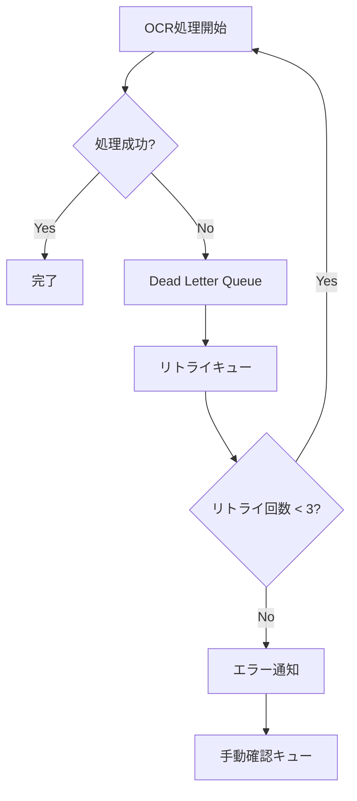
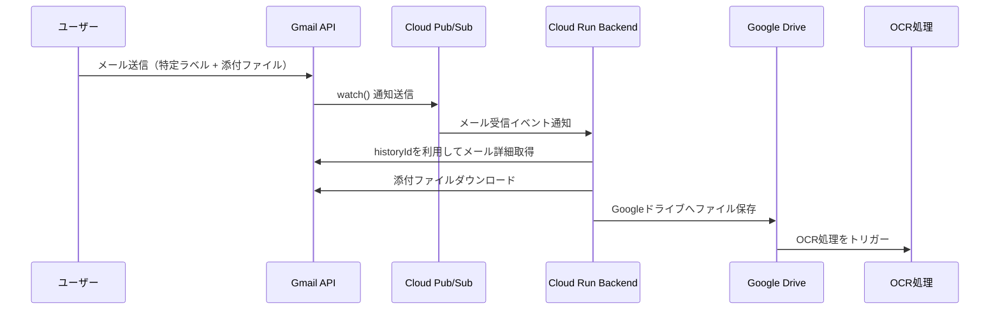

# Google Cloudを活用したファイル管理・OCR連携システム 設計ドキュメント

## 全体概要

本システムは、Google Cloud上でPDFや画像ファイルのOCR処理を自動化し、ファイル名のリネーム、フォルダ移動、及びメタ情報管理を効率化することを目的としています。

*   **入力**: Google DriveにアップロードされたPDF/画像ファイル
*   **OCR処理**:
    *   Vision APIでOCRを実施し、取得テキストはスペースや改行を除去したひと続きの文字列に正規化
    *   Firestoreに保持する正規化済みマスター（利用者、事業所、書類）との完全一致を照合し、カテゴライズ情報を取得
    *   必要な情報が不足している場合は、対象カテゴリーのみDocument AIで再解析を実施
    *   さらに、どうしても取得できない場合は、Vertex AI（Gemini 2.0 Flash等）によるAIサジェストをフロント側で提示し、ユーザーが候補を適用または手動入力できる仕組みを提供
*   **データ管理**:
    *   マスター情報はFirestoreに保持
    *   OCR処理結果（各ファイルのURL、照合結果、カテゴライズ情報）はBigQueryにトランザクションデータとして蓄積
*   **連携**: Gmail連携モジュールにより、特定ラベル付きメールの添付ファイルを自動取得し、Google Driveへ保存。そこからOCR処理がトリガーされる
*   **認証**: Firebase Authenticationによるシングルサインオン、及び管理者によるドメイン・権限管理

## 1. システム全体の概要

*   **Google Drive**: ファイルのアップロード・変更（PDF/画像）が入力となる。
*   **Cloud Functions**: Google Drive APIのWebhookによりファイル変更を検知し、Pub/Subを介してバックエンド処理をトリガー。
*   **Cloud Run (Backend)**: REST APIサーバとして動作し、以下の業務ロジックを実施
    *   Google DriveからファイルをCloud Storageへコピー
    *   OCR処理（Vision API、Document AIによる二段階方式およびAIサジェスト）
    *   Firestoreのマスター照合（利用者、事業所、書類）
    *   BigQueryへのトランザクションデータ書き込み
    *   必要に応じてDrive API経由でファイルのリネームやフォルダ移動
*   **Cloud Storage**: OCR処理用に一時ファイルを保管
*   **Vision API / Document AI / Vertex AI**:
    *   まずVision APIでOCR処理を行い、抽出テキストをスペースや改行除去した連結文字列に変換
    *   マスターとの完全一致照合で取得できなかった項目について、対象カテゴリーのみDocument AIで再解析
    *   それでも不足の場合は、Vertex AI（Gemini 2.0 Flash等）でFirestoreマスターから類似候補をAIサジェスト
*   **Firestore**:
    *   利用者、事業所、書類などのマスター情報を正規化済みの値（スペース・改行除去済み）で保持
    *   各マスターには固有のPKを設定し、OCR照合結果の基準とする
*   **BigQuery**:
    *   各OCR処理の結果、ファイルURL、照合されたマスターのPK（カテゴライズ情報）などのトランザクションデータを蓄積
    *   ファイルのフォルダー構造表現や集計、検索に利用
*   **Cloud Run (Frontend)**: ユーザーUI・管理画面をホストし、OCR結果の確認、AIサジェストの適用、手動補正などの操作を提供
*   **Firebase Authentication**: Googleアカウントによるシングルサインオンで認証を実施し、アクセス制御を行う
*   **Cloud Scheduler**: 定期処理（例: Gmailのwatch()再設定、OCR再解析ジョブなど）を自動実行し、運用の安定性を担保

## 2. システム構成図

```mermaid
graph LR
    subgraph Auth[Firebase Authentication]
        AA1[サインアップ/サインイン]
        AA2[認証トークン管理]
    end

    subgraph GoogleDrive[Google Drive]
        A1[ファイルアップロード/変更]
    end

    subgraph DriveAPI[Google Drive API]
        B1[リネーム/移動/変更検知]
    end

    subgraph CF[Cloud Functions]
        C1[Drive変更検知]
        C2[Pub/Sub通知]
    end

    subgraph CRBackend[Cloud Run - Backend]
        D1[OCR処理ロジック]
        D2[Vision API OCR]
        D3[Document AI OCR (不足時)]
        D4[AIサジェスト (Vertex AI)]
        D5[マスター照合処理]
        D6[結果統合・更新]
    end

    subgraph GCS[Cloud Storage]
        E1[一時ファイル保管]
    end

    subgraph FS[Firestore]
        F1[利用者マスター]
        F2[事業所マスター]
        F3[書類マスター]
    end

    subgraph BQ[BigQuery]
        G1[OCR/カテゴライズトランザクションデータ]
    end

    subgraph CRFrontend[Cloud Run - Frontend]
        H1[ユーザーUI]
        H2[管理画面（AIサジェスト設定）]
    end

    AA1 --> H1
    AA1 --> H2
    AA2 --> D1
    AA2 --> H1
    AA2 --> H2

    A1 --> B1
    B1 --> C1
    C1 --> C2
    C2 --> D1
    D1 --> D2
    D2 --> E1
    E1 --> D5
    D5 --> F1
    D5 --> F2
    D5 --> F3
    D5 --> G1

    %% 二次処理（不足時のみ）
    D1 --> D3
    D3 --> D5
    %% AIサジェスト
    D1 --> D4
    D4 --> D5

    H1 --> G1
    H2 --> D4
```

## 3. 機能ごとの詳細

### 3.1 バックエンドコンポーネント

*   **Cloud Functions**
    *   Drive APIのWebhookでファイルアップロード・変更を検知
    *   Pub/Sub通知によりCloud Run Backendへイベントを伝達
*   **Cloud Run (Backend)**
    *   ファイル取得: Drive API経由でアップロードファイルをCloud Storageへ一時コピー
    *   OCR処理:
        *   Vision API: まずOCRを実施、抽出テキストからスペース・改行等を除去して連結文字列を生成
        *   マスター照合: 連結文字列をFirestoreの各マスター（利用者、事業所、書類）と完全一致で照合
        *   Document AI（不足時のみ）: Vision APIで不足したカテゴリーのみ再解析し、同様の正規化・照合を実施
        *   AIサジェスト: それでも情報が取得できない場合、Vertex AI（Gemini 2.0 Flashなど）で類似候補を抽出。フロント側で候補提示し、ユーザーが適用または手動設定できるよう管理画面を用意
    *   結果統合: 各OCR処理の結果を統合し、ファイルのカテゴライズ情報として確定。必要に応じDrive APIを介しファイル名のリネーム/フォルダ移動を実施
    *   データ蓄積: 最終結果をBigQueryへ、各処理結果とともにトランザクションデータとして書き込む
*   **Firestore**
    *   利用者／事業所／書類などのマスター情報を、スペースや改行を除去した正規化済みの値で保持
    *   各マスターに固有のPKを設定し、OCR結果の照合基準とする
*   **BigQuery**
    *   各OCR処理の結果、ファイルURL、照合されたマスターのPK（カテゴライズ情報）などのトランザクションデータをレコード毎に蓄積
    *   フロントでのフォルダー構造表現、集計、検索、レポート生成に活用
*   **Cloud Storage**
    *   OCR処理用にファイルの一時保存領域として利用
*   **Gmail連携モジュール**
    *   Gmail APIのwatch()機能で特定ラベル付きメールの監視
    *   Cloud Pub/Sub通知経由でバックエンドへメールイベントを伝達
    *   バックエンドで添付ファイルをダウンロードし、Google Driveへ保存、以降OCR処理を自動トリガー

### 3.2 フロントエンドコンポーネント

*   **Cloud Run (Frontend)**
    *   ユーザーUIとして、Google Drive上のファイル一覧、OCR結果、カテゴライズ情報の検索・表示を実施
    *   AIサジェスト候補の表示と、適用または手動修正のインターフェースを提供
    *   管理画面にて、各種運用設定（AIサジェストの基本適用設定、OCRパラメータなど）を管理
*   **Drive API / Firestore API / BigQuery API**
    *   各サービスからデータを取得し、ファイルプレビュー、検索、集計を実現

### 3.3 認証・認可システム

#### 3.3.1 認証フロー
  1. **ログインフロー**
     ```mermaid
     sequenceDiagram
         participant User as ユーザー
         participant Frontend as フロントエンド
         participant Firebase as Firebase Auth
         participant Backend as バックエンド
         participant Firestore as Firestore
         participant BigQuery as BigQuery

         User->>Frontend: アクセス
         Frontend->>Firebase: 認証状態確認

         alt 未認証
             Frontend->>Frontend: Googleログイン画面表示
             User->>Frontend: Googleアカウントでログイン
             Frontend->>Firebase: Google認証リクエスト
             Firebase->>Frontend: IDトークン発行
         end

         Frontend->>Backend: APIリクエスト + IDトークン
         Backend->>Firebase: トークン検証
         Backend->>Firestore: ユーザー情報取得
         Backend->>Backend: ドメイン検証

         alt 認証エラー
             Backend->>Frontend: エラーレスポンス
             Frontend->>User: エラー表示
         else 認証成功
             Backend->>BigQuery: 監査ログ記録
             Backend->>Frontend: ユーザー情報
             Frontend->>User: ダッシュボード表示
         end
     ```

  2.  **APIエンドポイント一覧**

      a.  ユーザー管理

      ```
      POST   /users              - 新規ユーザー作成（管理者のみ）
      GET    /users/{user_id}    - ユーザー情報取得
      PUT    /users/{user_id}    - ユーザー情報更新
      DELETE /users/{user_id}    - ユーザー削除（管理者のみ）
      ```

      b.  認証設定

      ```
      GET    /auth/settings      - 認証設定取得
      PUT    /auth/settings      - 認証設定更新（管理者のみ）
      ```

      c.  ドメイン管理

      ```
      POST   /auth/domains       - 許可ドメイン追加（管理者のみ）
      GET    /auth/domains       - 許可ドメイン一覧取得
      PUT    /auth/domains/{id}  - 許可ドメイン更新（管理者のみ）
      GET    /auth/validate-domain/{domain} - ドメイン検証
      ```

  3.  **エラーハンドリング**
      *   400: リクエスト不正
      *   401: 認証エラー
      *   403: 権限エラー
      *   404: リソース未発見
      *   500: サーバーエラー

  4.  **監査ログ**
      記録対象のアクション：
      *   ユーザーログイン/ログアウト
      *   ユーザー作成/更新/削除
      *   認証設定の変更
      *   ドメイン設定の変更
      *   アクセス拒否（ドメイン制限など）

#### 3.3.2 ユーザー管理

  1.  **ユーザー情報**
      *   ユーザーID
      *   メールアドレス
      *   ユーザー名
      *   ロール（一般ユーザー、管理者）
      *   所属情報

  2.  **ユーザー権限**
      *   一般ユーザー
          *   ファイルの閲覧・アップロード
          *   自身のプロファイル管理
      *   管理者
          *   ユーザー管理
          *   認証設定の管理
          *   システム設定の管理

  3.  **ユーザー管理画面**
      *   ユーザー一覧
      *   ユーザー追加
      *   ユーザー編集
      *   ユーザー削除

#### 3.3.3 認証設定

  1.  **認証方式**
      *   Googleアカウント認証（シングルサインオン）

  2.  **認証設定**
      *   許可ドメインの追加・編集・削除
      *   個別アカウントの追加・編集・削除
      *   認証ポリシーの設定

  3.  **認証設定画面**
      *   認証設定一覧
      *   認証設定追加
      *   認証設定編集
      *   認証設定削除

#### 3.3.4 ドメイン管理

  1.  **許可ドメイン**
      *   許可ドメインの追加・編集・削除

  2.  **ドメイン検証**
      *   ドメインの検証

  3.  **ドメイン管理画面**
      *   許可ドメイン一覧
      *   許可ドメイン追加
      *   許可ドメイン編集
      *   許可ドメイン削除

### 3.4 ロールベースアクセス制御（RBAC）

  1.  **ロール**
      *   一般ユーザー
      *   管理者

  2.  **権限**
      *   ファイルの閲覧・アップロード
      *   自身のプロファイル管理
      *   ユーザー管理
      *   認証設定の管理
      *   システム設定の管理

  3.  **ロール割り当て**
      *   ユーザーにロールを割り当てる

### 3.5 監査ログ

  1.  **監査ログ**
      *   ユーザーログイン/ログアウト
      *   ユーザー作成/更新/削除
      *   認証設定の変更
      *   ドメイン設定の変更
      *   アクセス拒否（ドメイン制限など）

  2.  **監査ログ画面**
      *   監査ログ一覧
      *   監査ログ詳細

## 4. システム構成図（再掲）

（上記の構成図と同様）

## 5. デプロイ手順

### 5.1 Firebase設定

```bash
# 1. Firebase CLIのインストール
npm install -g firebase-tools

# 2. Firebase プロジェクトの初期化
firebase login
firebase init

# 3. Authentication有効化とGoogleプロバイダーの設定
firebase projects:list
firebase use <project-id>
firebase deploy --only auth

# 4. 認証ドメインの設定
# Firebase ConsoleでAuthentication > Sign-in methodから
# - Googleプロバイダーを有効化
# - 承認済みドメインの設定
# - 組織のGoogleワークスペースドメイン制限

# 5. Firestore セキュリティルールのデプロイ
firebase deploy --only firestore:rules
```

### 5.2 サービスアカウント・IAM設定

```bash
# サービスアカウント作成
gcloud iam service-accounts create ocr-service \
  --description="OCR processing & categorization service" \
  --display-name="OCR Service"

# 必要なIAMロールの付与
SERVICE_ACCOUNT="ocr-service@<project-id>.iam.gserviceaccount.com"
gcloud projects add-iam-policy-binding <project-id> \
  --member="serviceAccount:$SERVICE_ACCOUNT" \
  --role="roles/run.invoker"
gcloud projects add-iam-policy-binding <project-id> \
  --member="serviceAccount:$SERVICE_ACCOUNT" \
  --role="roles/datastore.user"
gcloud projects add-iam-policy-binding <project-id> \
  --member="serviceAccount:$SERVICE_ACCOUNT" \
  --role="roles/bigquery.dataEditor"
```

### 5.3 Cloud Functions / Cloud Runのデプロイ

```bash
# Cloud Functions: Drive API Webhook等のトリガー設定
gcloud functions deploy setup_gmail_watch \
  --runtime python39 \
  --trigger-http \
  --region asia-northeast1 \
  --service-account $SERVICE_ACCOUNT

# Cloud Run (Backend: OCR処理、照合、Document AI/AIサジェスト処理)
gcloud run deploy ocr-backend \
  --image="us-central1-docker.pkg.dev/<project-id>/myrepo/ocr-backend:v1" \
  --service-account="$SERVICE_ACCOUNT" \
  --region="us-central1" \
  --allow-unauthenticated=false
```

### 5.4 Cloud Scheduler設定例

```bash
gcloud scheduler jobs create http gmail-watch-refresh \
  --schedule "0 0 * * 6" \
  --uri "https://<your-cloud-function-url>" \
  --http-method POST
```

### 5.5 環境変数設定 (.env)

```
PROJECT_ID=<your_project_id>
GMAIL_WATCH_TOPIC=<your_pubsub_topic>
GMAIL_TARGET_FOLDER_ID=<drive_folder_id>
GMAIL_SERVICE_ACCOUNT=<service_account_email>
```

## 6. CI/CDパイプライン設計

*   **自動ビルド・テスト**: GitHubへのコミットでCloud Buildが自動ビルド・テストを実施。エラー検出時は即時通知。
*   **自動デプロイ**: テスト成功後、Cloud BuildがCloud Run（Backend／Frontend）やCloud Functionsへの自動デプロイを実施。ステージング環境および本番環境へのリリースをシームレスに実現。
*   **継続的フィードバックと監視**: Cloud Monitoring、Cloud Loggingと連携し、デプロイ後のパフォーマンスやエラー状況をリアルタイムに監視。改善サイクルを促進。

## 7. ログ管理と監査

| 監視対象                | 管理内容                                                        |
| ----------------------- | --------------------------------------------------------------- |
| **Cloud Logging**       | アプリケーション全体のログ収集、Stackdriver上で管理            |
| **Cloud Audit Logs**    | Drive API、Firestore等へのアクセス監査                         |
| **Security Command Center** | セキュリティ脆弱性・リスクの一元管理                         |

ログはBigQueryへエクスポートし、長期保存および詳細分析にも利用可能

## 8. 運用上のポイント

*   **スケーラビリティ**: Driveへの大量ファイルアップロード時はPub/Subでキューイング、Cloud Runが自動スケール
*   **コスト管理**: BigQueryテーブルはパーティション分割、テーブル寿命設定でクエリコストを抑制
*   **エラーリトライ**: OCR失敗やAPIエラー時は自動リトライ、Dead Letter Queueで管理
*   **権限範囲の絞り込み**: 定期的にIAMロールやサービスアカウントの権限を見直し、不要な権限を削除
*   **監査ログのモニタリング**: Cloud Loggingのアラート機能で不審な挙動を早期検出

## 9. エラーハンドリングと復旧戦略

### 9.1 OCR処理のエラーハンドリング



*   **リトライ戦略**: 最大3回、指数バックオフ（1分、5分、15分）
*   **タイムアウト対策**:
    *   Cloud Functions最大540秒
    *   大容量ファイル処理はCloud Runへオフロード
    *   非同期処理はPub/Subによるメッセージングで管理

### 9.2 データ整合性の確保

*   **トランザクション管理**: Firestore更新とBigQuery更新の整合性確保、楽観的ロック、バージョン管理でのロールバック対応
*   **データ検証**: スキーマバリデーション、入力値正規化、重複チェック、API入力値検証、セキュリティチェック

## 10. システムデプロイ手順例

（上記「5. デプロイ手順」参照）

## 11. Gmail連携モジュール

### 11.1 概要

Gmail APIのwatch()機能を利用し、特定ラベル付きメールをリアルタイム検知。Cloud Pub/Sub経由で通知を受け、バックエンドでメール詳細取得、添付ファイルダウンロード、Google Drive保存、以降OCR処理を自動トリガー

### 11.2 システム構成



### 11.3 認証と権限

#### 11.3.1 サービスアカウントの利用

*   Gmail API／Google Drive API操作用のサービスアカウントを作成
*   Google Workspace管理コンソールでドメイン全体の委任設定を実施

#### 11.3.2 Googleドライブ権限

*   サービスアカウントを対象フォルダの編集者に追加
*   APIや自動化スクリプトでフォルダ権限を設定

#### 11.3.3 Pub/Subの設定

```bash
gcloud pubsub topics create gmail-watch-topic
```

### 11.4 デプロイ手順

```bash
# Gmail APIの有効化
gcloud services enable gmail.googleapis.com

# サービスアカウント作成
gcloud iam service-accounts create gmail-integration \
   --description="Gmail連携用サービスアカウント" \
   --display-name="Gmail Integration Service Account"

# 必要なIAMロールの付与
gcloud projects add-iam-policy-binding <project-id> \
   --member="serviceAccount:gmail-integration@<project-id>.iam.gserviceaccount.com" \
   --role="roles/gmail.readonly"
gcloud projects add-iam-policy-binding <project-id> \
   --member="serviceAccount:gmail-integration@<project-id>.iam.gserviceaccount.com" \
   --role="roles/pubsub.publisher"
gcloud projects add-iam-policy-binding <project-id> \
   --member="serviceAccount:gmail-integration@<project-id>.iam.gserviceaccount.com" \
   --role="roles/iam.serviceAccountUser"

# Pub/Subトピック作成（例）
gcloud pubsub topics create gmail-watch-topic

# watch()設定（Cloud Functionsで実装例）
gcloud functions deploy gmail-watch \
   --runtime nodejs16 \
   --trigger-topic gmail-watch-topic \
   --entry-point handleGmailWatchEvent \
   --service-account gmail-integration@<project-id>.iam.gserviceaccount.com
```

### 11.5 エラーハンドリングと監視

```mermaid
graph TD
    A[watch() 設定] --> B{有効期限超過?}
    B -->|No| C[継続監視]
    B -->|Yes| D[watch() 再登録]
    D --> A
```

*   watch()の有効期限は約7日間
*   Cloud Schedulerで定期的に再登録ジョブを実行

```bash
gcloud scheduler jobs create http gmail-watch-refresh \
  --schedule "0 0 * * 6" \
  --uri "https://<your-cloud-function-url>" \
  --http-method POST
```

### 11.6 まとめ

*   Gmailのwatch()機能を利用し、特定ラベル付きメールをリアルタイム検知
*   添付ファイルは自動的にダウンロード・Google Driveへ保存、その後OCR処理へ連携
*   定期更新、エラーハンドリング、リトライ戦略を実装し、システムの安定運用を確保

## 12. 運用上のポイント (再掲)

*   **スケーラビリティ**: Driveへの大量アップロード時はPub/Subを介してCloud Runが自動スケール
*   **コスト管理**: BigQueryのパーティション設定、テーブル寿命設定でコスト削減
*   **エラーリトライ**: OCR失敗やDrive APIエラー時は自動リトライ・Dead Letter Queueにより管理
*   **権限管理**: IAMロール、サービスアカウントの定期見直しで不要な権限を削除
*   **監査ログの活用**: Cloud Loggingのアラート機能で不審な挙動を早期検出

## 13. まとめ

*   **イベント駆動型システム**: Cloud Functions＋Cloud Runによるイベントドリブンな構成で、ファイルアップロードからOCR処理、カテゴライズ、及び管理まで自動化
*   **OCR処理の二段階方式**:
    *   Vision APIで基本OCRを実施し、スペースや改行を除去した連結文字列を生成
    *   → Firestoreのマスター（利用者／事業所／書類）と完全一致照合
    *   → 不足時は対象カテゴリーのみDocument AIで再解析
    *   → さらに不足する場合はVertex AI（Gemini 2.0 Flash等）で類似候補をAIサジェストし、ユーザーが適用または手動設定可能
*   **データ管理の分離**: マスター情報はFirestoreに保持、OCR結果およびカテゴライズ情報はBigQueryにトランザクションデータとして蓄積し、フロントエンドで効率的な検索・集計を実現
*   **Gmail連携による自動化**: Gmail APIのwatch()機能とPub/Sub、Cloud Functions連携で、特定ラベル付きメールの添付ファイル取得からOCR処理への自動フローを構築
*   **運用の自動化・監視**: Cloud Schedulerで定期処理（例: watch再登録）を実行、エラーリトライ・監査ログのモニタリングによりシステムの安定運用を確保

この設計により、完全一致による正確なカテゴライズを前提としたOCR自動化システムと、必要に応じたAIサジェストによるユーザー補正機能が統合された、堅牢かつ柔軟なファイル管理システムが構築可能となります。