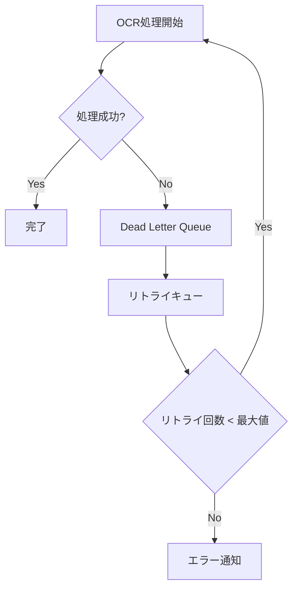

# OCR処理フロー詳細設計

## OCR処理パイプライン

### 1. 前処理
- ファイル形式の検証
- 画像の前処理（必要な場合）
- OCRエンジンの選択ロジック

### 2. テキスト抽出プロセス

#### Vision APIによる基本処理
- テキスト抽出
- 空白・改行の正規化
- 文字列の正規化処理

#### Document AIによる高度解析
- 特定フォーマットの認識
- 構造化データの抽出
- メタデータの抽出

#### Vertex AI（Gemini）によるAI解析
- コンテキスト理解
- 情報補完
- 分類提案

### 3. エラー処理とリトライ

### 4. 後処理
- 結果の検証
- メタデータの更新
- 通知の送信

## パフォーマンス最適化

### バッチ処理
- 複数ファイルの同時処理
- リソース使用量の制御
- 優先順位付け

### キャッシュ戦略
- 処理結果のキャッシュ
- 一時的なストレージの利用
- キャッシュの有効期限管理

## モニタリングとアラート

### 監視項目
- 処理速度
- エラー率
- リソース使用率

### アラート条件
- エラー率閾値
- 処理遅延
- リソース枯渇
